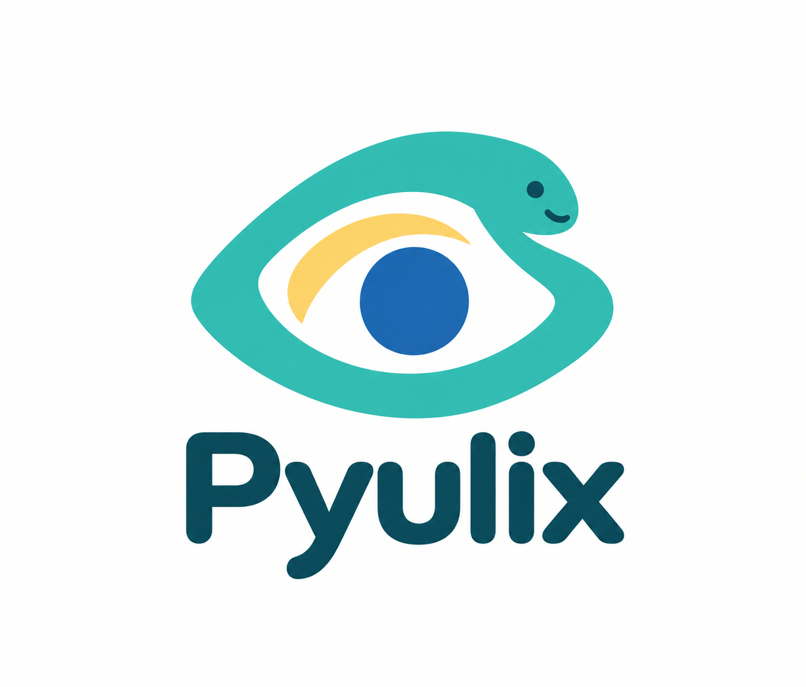

> **Independent fork:** Pyulix is maintained by **Ajay Rakde** and is neither affiliated with nor endorsed by the OculiX project. Original work by Julien Mer and contributors; original copyright and MIT license notices are preserved. [Support](https://github.com/ajayrakde/Operix/issues).

# Pyulix



Independent Python visual automation bridge for the OculiX Java engine.
Maintained and supported by **Ajay Rakde**. Release target: **1.2.0b2 (beta)**.

```bash
pip install --pre pyulix
```

```python
from pyulix import Screen
Screen().click("button.png")
```

Requires Python 3.8+ and Java 17+. The fork's JVM bridge downloads on first use
and is cached separately at `~/.pyulix/lib/`.

- [Python documentation and migration](python/README.md)
- [Support and bug reports](https://github.com/ajayrakde/Operix/issues)
- [Branding and attribution audit](docs/rebranding-audit.md)

## Repository contents

`python/` contains Pyulix; `jvm-bridge/` contains its JSON-RPC bridge;
`tools/` and `docs/` contain API generation, checks, and implementation notes.
The inherited `nodejs/` and `dotnet/` wrappers are reference sources, not supported
Pyulix releases. Publishing them from this fork is disabled.

## Credits and license

Original Operix work by Julien Mer and contributors. The original notice
Copyright (c) 2026 oculix-org is retained verbatim in [LICENSE](LICENSE).
See [NOTICE](NOTICE). The separately downloaded OculiX engine and its bundled
third-party libraries retain their own licenses and notices.
